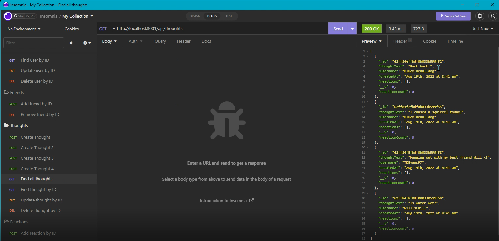

# Social-Media-API
  
  ## Table Of Contents
  + [Description](#description)
  + [Installation Instructions](#installation-instructions)
  + [Usage Information](#usage-information)
  + [Contribution Guidelines](#contribution-guidelines)
  + [Test Instructions](#test-instructions)
  + [Questions](#questions)

  
  ---
  ## Description
  This Social Media API is a backend application that demonstrates CRUD functionality for users, thoughts (posts), and reactions (comments/replies). Examples of the functionality are provided below. 
  
  Upon creation, each user is assigned a unique id. This id is then used to update and delete users as necessary in addition to assigning friends to a user (by their respective user id). When a friend is assigned to a user, another unique id is created to demonstrate this friendship association between users. A user may opt to remove a friend from their friends list by using this unique friend id. 

  This social media app also allows users to post thoughts. When a thought is created, this thought is given a unique id to reference when updating, removing, or reacting to later on. A single user can create multiple thoughts. In addition, other users can react or reply to this thought with comments. When a reaction is created, it is referencing the unique id given to the thought. Upon creation, a reaction is given a unique id. This allows us to reference the reaction id for removal if desired. 

  ## Installation Instructions
  Use the terminal command ```npm i``` to install all dependencies. 
  
  ## Usage Information
  Use the terminal command ```npm start``` to start the server. CRUD Functionality can be tested in desktop applications such as Insomnia and Postman. 

  ---

  ## Contribution Guidelines
  We are not accepting contributions at this time. 
  ## Test Instructions
  Please refer to the following video to view the CRUD functionality of this social media API. 

  [Video demonstration](https://drive.google.com/file/d/1iX3TnFhzp99FLvszxhKtzAxwNddfWumo/view)
  ## Questions
  If you have any questions, feel free to reach out to me with the following contact methods:

  GitHub: https://github.com/TDEvans97   Email: tylerdevansmusic@gmail.com

  Thank you for supporting this app,

  Tyler Evans
  